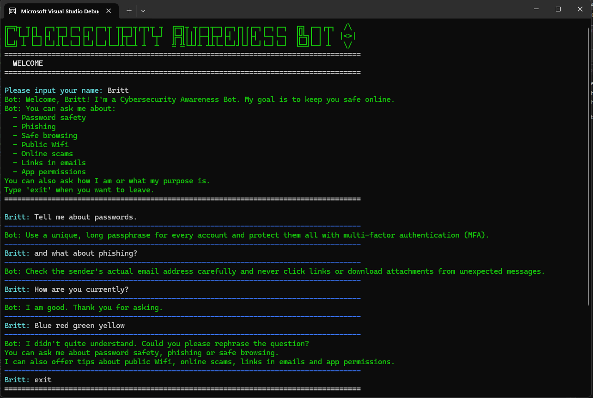

# Cybersecurity Awareness Bot

This is a C# project that was built for my POE assignment for Programming 2A. It is a chatbot that shares safety tips with users about how to be safe online.

Once the project starts it greets the user with a recorded voice message, then displays ASCII art with the title "Cybersecurity Awareness Bot", then asks the user for their name and personally greets them. After that the user can ask for a password safety tip, phishing tip or safe browsing tip. You can also ask the bot how it is and what its purpose is. You can exit the program by typing `exit`, `quit`, `bye` or `end`.

# Part 1 of Assignment

- **Name:** Brittany Haupt
- **Student number:** ST10500773
- **Module:** PROG6221 Programming 2A

## Project Structure
```
CybersecurityAwarenessBot/
├── CybersecurityAwarenessBot.sln
├── .github/workflows/
│ └── dotnet-ci.yml # GitHub Actions CI build workflow
└── CybersecurityAwarenessBot/
├── Program.cs # Entry point only
├── Bot/
│ ├── ChatBox.cs # Orchestrates the session and conversation loop
│ ├── ConsoleDisplayManager.cs # Colours, borders, dividers, typing effect
│ ├── LogoArt.cs # ASCII art title screen
│ ├── GreetingPlayer.cs # Plays the WAV voice greeting
│ ├── InputValidator.cs # Validates and normalises user input
│ ├── BotResponses.cs # Keyword to response lookup
│ └── UserProfile.cs # Stores user details using automatic properties
└── Media/
└── Bot.wav # Recorded voice greeting
```


## Features of Project (Part 1)

- **Voice greeting**: when the program starts it plays a WAV file to greet the user. The WAV file is played using `System.Media.SoundPlayer`.
- **ASCII art title**: displayed in colour when the program runs, after the voice greeting has played.
- **Asks the user for their name**: then uses the name throughout the conversation.
- **Keyword response system**: the bot answers questions on passwords, phishing and safe browsing.
- **Input validation**: the program handles the user entering whitespace or nothing at all, without crashing.
- **Formatted console interface**: the interface is easy to read because of the colours, section headers and dividers, and the slow typing response from the chatbot makes it feel like you are really talking to a computer.
- **Modular structure**: the logic is split into multiple classes to handle everything without overloading all the code into `Program.cs`.

## Requirements

- Can only be run on Windows, because `System.Media.SoundPlayer` only works on Windows.
- Visual Studio 2022 with the .NET desktop development workload, or the .NET 8 SDK.

## How to Run

1. Clone the repository.
2. Open `CybersecurityAwarenessBot.sln` in Visual Studio 2022.
3. Press Ctrl+F5 to build and run the project.

## Usage

You can ask the chatbot about password safety, phishing and safe browsing. The chatbot will give you a safety tip for any of the topics you select. You can also ask it "How are you?", "What is your purpose?" and "What can I ask you about?". You can exit the program by typing `exit`, `quit`, `bye` or `end`.

If the chatbot cannot recognise your question then it will respond with a default message asking you to rephrase your question.

Example of a conversation with the chatbot:


## Continuous Integration

The workflow is set up in GitHub so that every push triggers it. The workflow checks out the code, installs the .NET 8 SDK, restores dependencies and builds the solution in Release configuration.


## Video Presentation

YouTube link:

